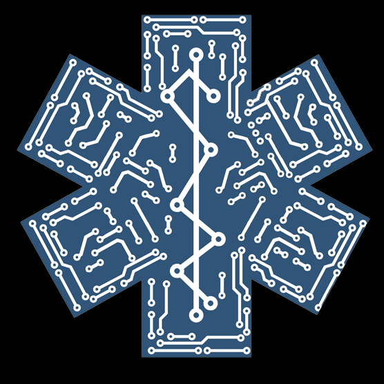
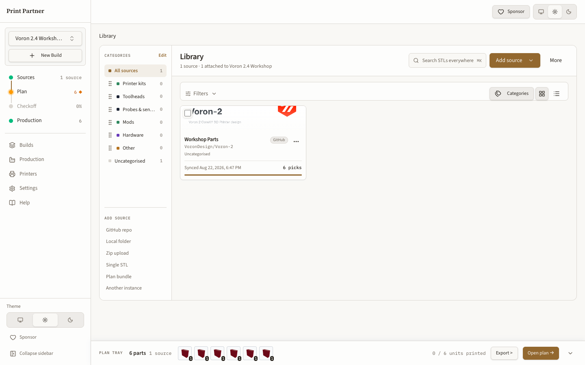
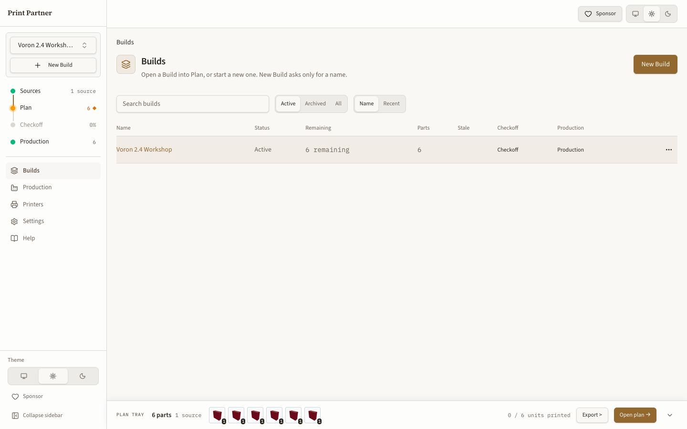
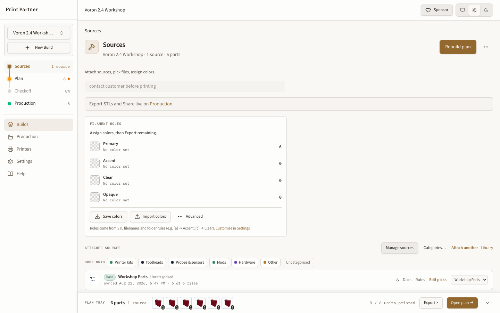
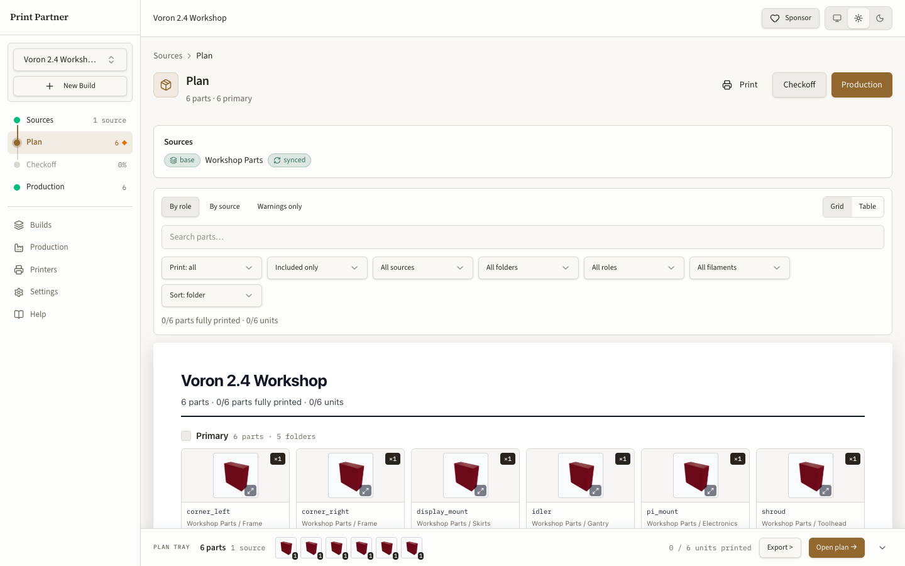
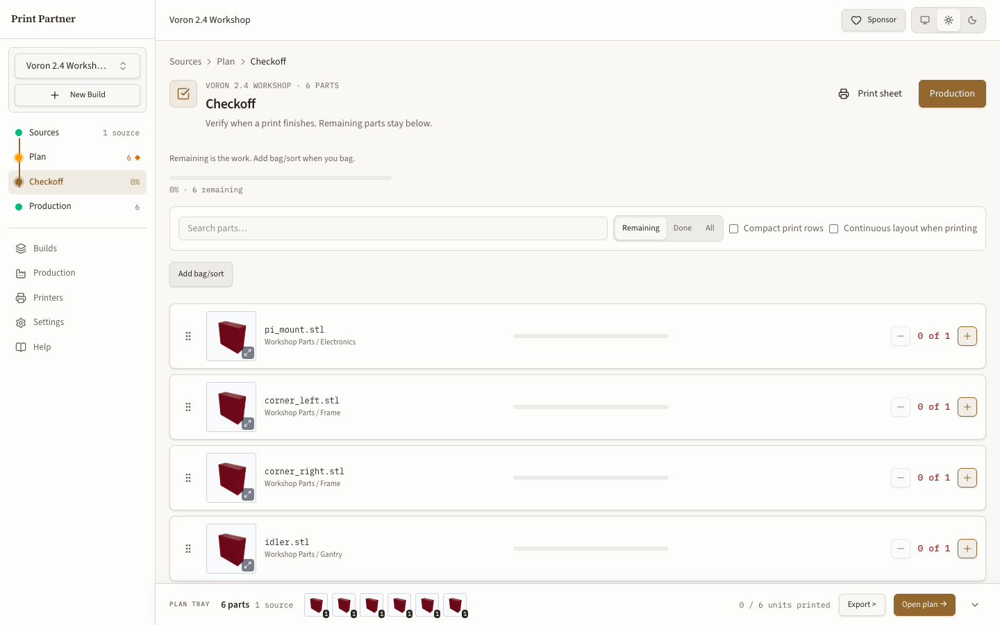
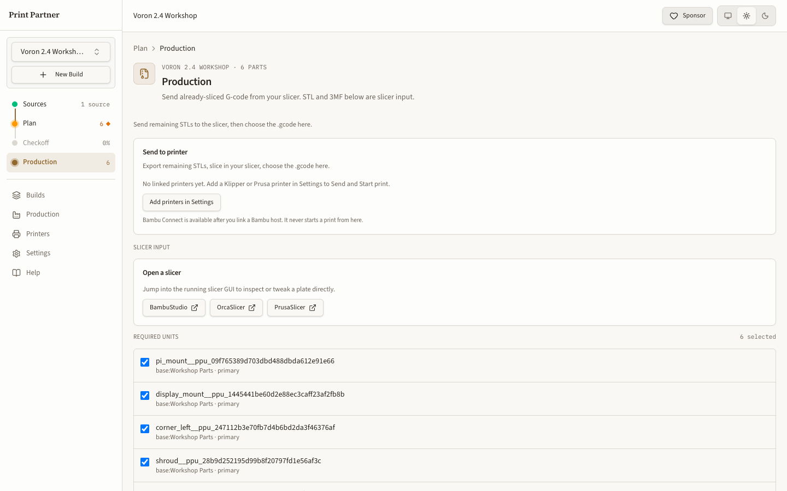

<p align="center">
  
</p>

<h1 align="center">Print Partner</h1>

<p align="center">
  A self-hosted workspace for planning and tracking layered STL kit builds.
</p>

<p align="center">
  <a href="https://github.com/sponsors/poitee"></a>
  <a href="LICENSE"></a>
</p>

<p align="center">
  <a href="https://poitee.github.io/PrintPartner/">Project site</a> ·
  <a href="#quick-start">Quick start</a> ·
  <a href="docs/INSTALL.md">Install guide</a> ·
  <a href="docs/README.md">Documentation</a> ·
  <a href="docs/assistant-mcp.md">MCP setup</a>
</p>

Print Partner keeps source files, build choices, quantities, print progress, and production handoff in one place. It runs as a single Docker container with a React interface and Fastify API. Self-hosted data stays in a Docker volume or directory you control.

## Workflow

| Area | Purpose |
|------|---------|
| **Library** | Register GitHub repositories, local folders, or zip files. Sync sources, set import rules, and search STL files. |
| **Builds** | Create, rename, duplicate, archive, and restore kit builds. |
| **Sources** | Attach sources to a build, choose STL files, set quantities, and assign role colors. |
| **Plan** | Review the draft, resolve warnings, and apply the accepted list. |
| **Checkoff** | Track each required unit through printing and assembly. |
| **Production** | Arrange plates, export 3MF or STL files, open a slicer, and send sliced files to linked printers. |

An active Build owns its Sources, Plan, Checkoff state, and Production workspace. The Library is shared across builds.

## Screenshots

Screenshots follow your light or dark GitHub theme.

### Library

<picture>
  <source media="(prefers-color-scheme: dark)" srcset="docs/screenshots/dark/library.png">
  <source media="(prefers-color-scheme: light)" srcset="docs/screenshots/light/library.png">
  
</picture>

### Builds

<picture>
  <source media="(prefers-color-scheme: dark)" srcset="docs/screenshots/dark/builds.png">
  <source media="(prefers-color-scheme: light)" srcset="docs/screenshots/light/builds.png">
  
</picture>

### Sources

<picture>
  <source media="(prefers-color-scheme: dark)" srcset="docs/screenshots/dark/sources.png">
  <source media="(prefers-color-scheme: light)" srcset="docs/screenshots/light/sources.png">
  
</picture>

### Plan

<picture>
  <source media="(prefers-color-scheme: dark)" srcset="docs/screenshots/dark/plan.png">
  <source media="(prefers-color-scheme: light)" srcset="docs/screenshots/light/plan.png">
  
</picture>

### Checkoff

<picture>
  <source media="(prefers-color-scheme: dark)" srcset="docs/screenshots/dark/checkoff.png">
  <source media="(prefers-color-scheme: light)" srcset="docs/screenshots/light/checkoff.png">
  
</picture>

### Production

<picture>
  <source media="(prefers-color-scheme: dark)" srcset="docs/screenshots/dark/production.png">
  <source media="(prefers-color-scheme: light)" srcset="docs/screenshots/light/production.png">
  
</picture>

## Quick start

Requirements: Docker with Compose v2.

```bash
git clone https://github.com/poitee/PrintPartner.git
cd PrintPartner
docker compose pull
docker compose up -d
```

Open [http://localhost:8080](http://localhost:8080). From another computer on the same network, replace `localhost` with the Docker host's LAN address.

<!-- release-version:start -->
The current release is `3.2.0`. The default Compose file uses `ghcr.io/poitee/print-partner:3.2.0`, and the app reports runtime version `3.2.0-web`.
<!-- release-version:end -->

To build the image from source:

```bash
docker compose up --build -d
```

The `print-partner-data` volume stores the SQLite database, synced repositories, thumbnails, and exports. `docker compose down` stops the app without deleting that volume.

See [the install guide](docs/INSTALL.md) for Docker setup, first-run steps, updates, bind mounts, and troubleshooting.

## First build

1. Add and sync a source in **Library**.
2. Select **New Build** and give the build a name.
3. Attach one or more sources and choose files on **Sources**.
4. Review quantities and warnings on **Plan**, then apply the draft.
5. Track printed units on **Checkoff**.
6. Arrange plates and export or send files from **Production**.

Press `Cmd+K` on macOS or `Ctrl+K` elsewhere to open the command palette. The in-app Help page covers the same workflow.

## Printer and slicer support

- Moonraker and PrusaLink support connection tests, status, G-code upload, and optional start.
- Bambu LAN MQTT provides status. Bambu Connect handles file handoff without reverse-engineered print-start commands.
- Spoolman can provide filament inventory and optional usage deductions.
- OrcaSlicer, PrusaSlicer, and Bambu Studio remain responsible for slicing.

Setup guides:

- [Printer connections](docs/integrations/PRINTER_SETUP.md)
- [Spoolman](docs/integrations/SPOOLMAN.md)
- [3MF validation](docs/3MF_EXPORT_VALIDATION.md)

## MCP access

Print Partner exposes product tools over streamable HTTP MCP at `/api/v1/mcp`. Set `PRINT_PARTNER_API_KEY` before connecting from another machine. Write operations require a separate confirmation call.

See [MCP setup](docs/assistant-mcp.md) for Cursor, Claude, and other MCP clients. A packaged Cursor plugin is available in [`cursor-plugin/print-partner`](cursor-plugin/print-partner).

## Configuration

The default self-host setup uses SQLite and local storage. Common variables are:

| Variable | Default | Purpose |
|----------|---------|---------|
| `PRINT_PARTNER_DATA_DIR` | `./data` or `/data` in Docker | Database, source files, exports, and thumbnails |
| `HOST` | `127.0.0.1` or `0.0.0.0` in Docker | Server bind address |
| `PORT` | `18765` or `8080` in Docker | HTTP port |
| `PRINT_PARTNER_API_KEY` | unset | Protects API and remote MCP access |
| `GITHUB_REPO` | `poitee/PrintPartner` | Repository used for update checks |
| `PRINT_PARTNER_UPDATE_CHECK` | enabled | Set to `0` to disable release checks |

See [deployment reference](web/DEPLOY.md) for authentication, CORS, OAuth, S3, email, and experimental SaaS settings. See [operations](OPERATIONS.md) for backups, metrics, API keys, and recovery.

## Local development

Requirements: Node.js 22 and npm 10 or later.

```bash
cd web
npm ci
npm run dev
```

The UI runs at [http://127.0.0.1:5173](http://127.0.0.1:5173). The API runs at [http://127.0.0.1:18765](http://127.0.0.1:18765).

Run the complete check before opening a pull request:

```bash
cd web
npm run quality
```

The monorepo contains four workspaces:

| Package | Role |
|---------|------|
| `@print-partner/web` | React and Vite client |
| `@print-partner/server` | Fastify API and static app server |
| `@print-partner/contracts` | Shared request and response types |
| `@print-partner/domain` | Framework-independent planning and export logic |

## Documentation

- [Documentation index](docs/README.md)
- [Install guide](docs/INSTALL.md)
- [Architecture](docs/ARCHITECTURE.md)
- [HTTP API](docs/API.md)
- [MCP setup](docs/assistant-mcp.md)
- [Deployment reference](web/DEPLOY.md)
- [Operations](OPERATIONS.md)
- [Security policy](SECURITY.md)
- [Changelog](CHANGELOG.md)

## License and attribution

Print Partner is licensed under [CC BY-NC 4.0](LICENSE). Read the [license summary](LICENSE-SUMMARY.md) for a plain-language overview.

The manifest format and kit organization workflow were inspired by [ThunderKeys' STL Manifest Generator](https://github.com/thunderkeys/stl-manifest-generator). See [ATTRIBUTION.md](ATTRIBUTION.md) and [THIRD_PARTY_NOTICES.md](THIRD_PARTY_NOTICES.md).
